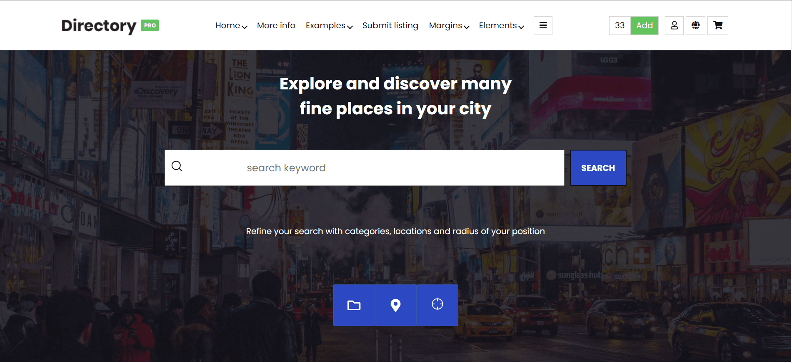
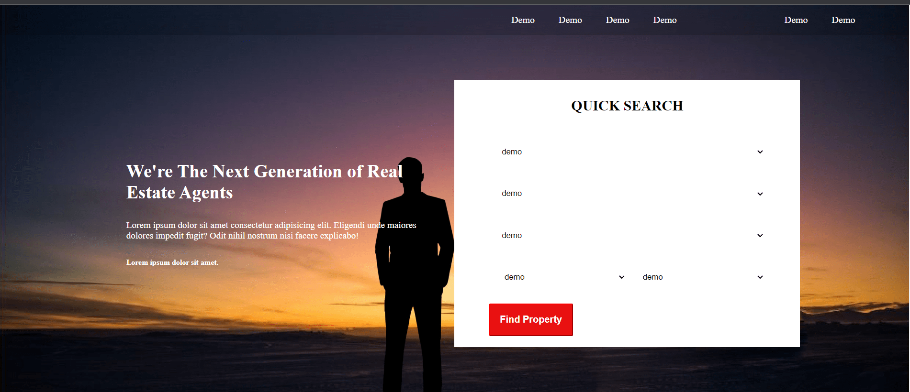

#Website
<h1>Websites Templates 😃📄</h1>
<a href="First_Template(Descover City)/index.html">
    

        
        
Discover City 

    

</a>
<!-- Second -->

<a href="Portfolio-template-main/index.html">
    

        
        
Portfolio

    

</a>
<!-- Third -->
<a href="Template1(Real Istate)/index.html">
    

        
        
Real Istate
 
    

</a>
<!-- Fourth -->
<a href="Template2(University)/index.html">
    

        
        
University

    

</a>
